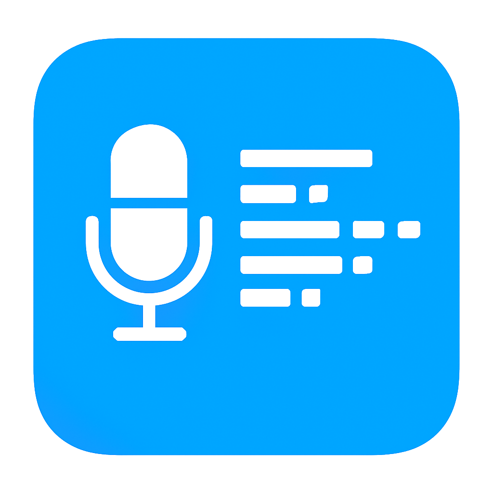

<div align="center">
  
  <h1>EchoNote</h1>
  <p><em>Unified Recording, Document Workspace & Local AI Meeting Notes</em></p>
</div>

<p align="center">
  <a href="LICENSE"></a>
  
  
  
</p>

<p align="center">
  <strong>🎙️ Capture • 🗂️ Organize • 🧠 Summarize • 🔒 Local First</strong>
</p>

### 🚀 Quick Start

**EchoNote** is a privacy-first desktop application that unifies recordings, documents, transcripts, summaries, and meeting briefs in a single local-first workspace.

#### Installation & Setup

```bash
# 1. Create virtual environment
python -m venv venv
source venv/bin/activate  # Windows: venv\Scripts\activate

# 2. Install dependencies
pip install -r requirements.txt

# 3. Launch application
python main.py
```

#### First Launch Setup

1. **Storage Configuration**: Choose paths for recordings and transcripts
2. **Model Download**: Download a Faster-Whisper model (recommend `base` for most users)
3. **FFmpeg Check**: Verify FFmpeg installation for media format support
4. **Loopback Check (First Run)**: Detect loopback input and show setup guidance if missing (one-click setup supports macOS/Windows/Linux with system authorization where required)
5. **Optional**: Configure calendar sync (Google/Outlook OAuth)

### 🎯 Key Features

- **🗂️ Unified Workspace**: Manage imported documents, batch transcriptions, realtime recordings, summaries, and meeting briefs in one editable asset workspace
- **🎙️ Local Speech Pipelines**: Process audio/video files or capture live recordings, then persist transcript and translation assets back into the workspace
- **🧠 Local Meeting AI**: Generate extractive summaries, ONNX small-model summaries, and GGUF-backed meeting briefs with editable outputs
- **📅 Calendar Integration**: Sync with Google Calendar and Outlook, manage local events
- **⏰ Timeline Intelligence**: Correlate events with recordings, automated task scheduling
- **🔒 Privacy-First**: Encrypted local storage, no cloud dependency required
- **🌍 Multilingual**: Multilingual speech recognition with extensible UI i18n support
- **🎨 Accessibility**: Keyboard navigation, screen reader support, multiple themes

### 📋 System Requirements

- **Python**: 3.10 or newer
- **Operating System**: macOS, Linux, Windows
- **Optional Dependencies**:
  - PyAudio (microphone capture)
  - FFmpeg (media format support)
  - CUDA GPU (Faster-Whisper acceleration)

### 🎧 System Audio & Meeting Capture Plan

- **Microphone-only capture**: Select a physical microphone input.
- **System audio capture**: Use a loopback input device (e.g., BlackHole, Loopback, VB-CABLE).
- **Online meeting capture**:
  - Route meeting/video app output to loopback input.
  - Keep meeting app microphone as your physical mic.
  - In EchoNote, select the loopback input device for recording.
  - If you need both local mic and remote playback in one track, use an aggregate/virtual mixer input.
- **If no loopback device is installed**:
  - macOS: install BlackHole/Loopback.
  - Windows: enable Stereo Mix or install VB-CABLE.
  - Linux: use PipeWire/PulseAudio monitor source.

### 🏗️ Architecture Overview

```
EchoNote/
├── main.py                # Application entry point
├── config/                # Configuration management & version control
├── core/                  # Business logic domains (workspace, models, realtime, timeline)
├── engines/               # Audio, speech, translation, and text-ai runtimes
├── data/                  # Database, security, storage
├── ui/                    # PySide6 desktop interface (workspace, timeline, settings)
├── utils/                 # Cross-cutting utilities
└── tests/                 # Test suites
```

Workspace architecture highlights:
- `core/workspace/`: unified asset layer for `workspace_items` and `workspace_assets`
- `engines/text_ai/`: extractive, ONNX, and GGUF local text AI runtimes
- `ui/workspace/`: single workbench for text editing, playback, and AI actions

### 📚 Documentation

| Audience         | Resource           | Location                                                   |
| ---------------- | ------------------ | ---------------------------------------------------------- |
| **Developers**   | API reference      | [`docs/DEVELOPER_GUIDE.md`](docs/DEVELOPER_GUIDE.md)       |
| **Contributors** | Coding standards   | [`docs/CODE_STANDARDS.md`](docs/CODE_STANDARDS.md)         |
| **Maintainers**  | CI/CD guide        | [`docs/CI_CD_GUIDE.md`](docs/CI_CD_GUIDE.md)               |
| **Website**      | Landing page source| [`echonote-landing/README.md`](echonote-landing/README.md) |

> Landing maintenance note: the Vue implementation in `echonote-landing/` is the active source.  
> `docs/landing/` is archived for historical reference only.  
> The active landing is a single-page, i18n-driven architecture with centralized link composition and GitHub Pages deployment from `.github/workflows/deploy-landing.yml`.

### 🧪 Development & Testing

```bash
# Install development dependencies
pip install -r requirements-dev.txt

# Run tests
pytest tests/unit                    # Unit tests
pytest tests/integration             # Integration tests
pytest tests/performance             # Performance tests

# Code quality checks
python scripts/sync_version.py       # Version consistency
pre-commit run --all-files          # Code formatting & linting
```

### 📄 License

Released under the [Apache 2.0 License](LICENSE). PySide6 (LGPL v3) is used for the UI layer and is fully compatible through dynamic linking.

---

## 📊 Project Status

- **Version**: v2.1.0 (Latest release)
- **Test Suite**: unit / integration / UI / performance categories
- **Code Quality**: Excellent (PEP 8 compliant, type-annotated)
- **Documentation**: Complete and restructured
- **License**: Apache 2.0 (fully compliant)

## 🤝 Contributing

We welcome contributions! Please see our [Contributing Guide](docs/CONTRIBUTING.md) for details on:

- Code standards and style guide
- Development workflow
- Testing requirements
- Documentation guidelines

## 📞 Support

- **Documentation**: [`docs/`](docs/) directory
- **Issues**: [GitHub Issues](https://github.com/johnnyzhao5619/EchoNote/issues)
- **Discussions**: [GitHub Discussions](https://github.com/johnnyzhao5619/EchoNote/discussions)

---

<p align="center">
  Made with ❤️ by the EchoNote team
</p>
